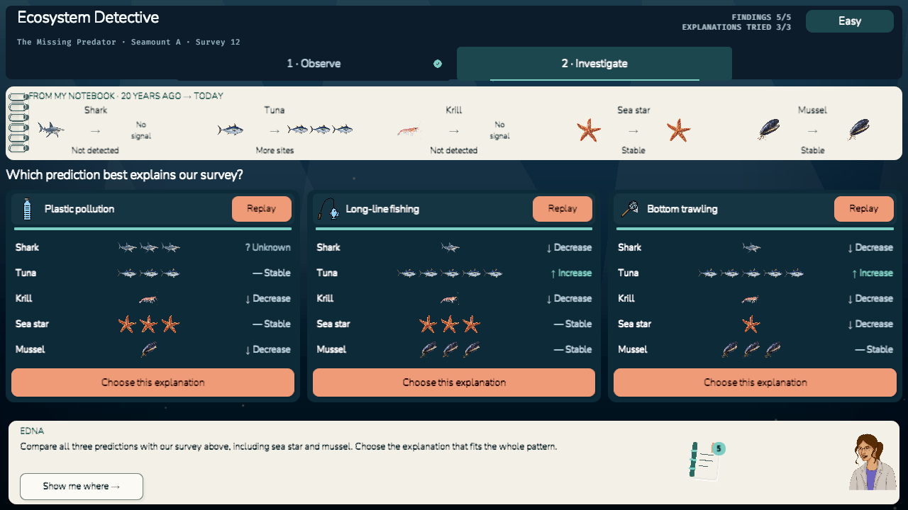
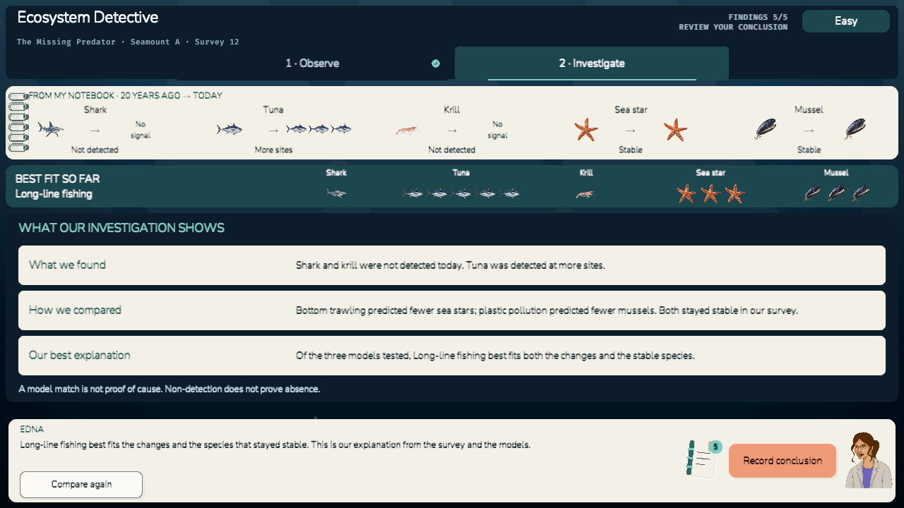

# Ecosystem Detective — current two-act game

Current behaviour as of 2026-09-09. This is the primary gameplay specification for
our part of the OceanX eDNA Detectives Unity project. Implementation details for
the second act are in [Act 2](docs/Act2-Scenario-Comparison.md).

Players collect and compare two dated surveys in **Observe**, then use three
animated prediction cards in **Investigate**. EDNA guides both acts. Choosing a
model leads directly to a summary of the player's findings and model comparisons.
There is no separate Report tab, ROV minigame, unseen field evidence, or final quiz.

## Quick start

1. Open `game` in Unity **6000.4.6f1**.
2. Open `Assets/Scenes/InvestigationScene.unity` (the first enabled build scene).
3. Press Play. The authored case is playable without another minigame connected.

## Current gameplay flow

### 1 · Observe

Players compare the same seamount **20 years ago** and **today** with a sliding lens, divided into shallow, mid, and deep depth bands. The two maps align spatially; moving the divider changes which survey is visible without scaling the maps.

A new investigation opens on **Today**, with the slider at the far left. EDNA first
invites the player to **Start recording**, with no answer choices visible. Current
survey icons travel along an arc into matching notebook rows. Only current detections
are recorded: in the authored case, tuna, sea star and mussel. The scene retains its survey artwork for comparison.
After recording, **Compare with the past** enables the lens. At the far right,
**Record 20 years ago** becomes available and animates the five historical detections
into a separately dated notebook section. Shark and krill first enter the notebook
here, marked as detected 20 years ago. **Compare the two surveys** then opens the species sorting table. Imported findings skip this introductory collection step.

The Start recording action pulses first. Once historical comparison begins, the
slide handle pulses until used. The selected organism has a static
outline, and optional species facts never record an answer. Notebook survey notes
are separate from the player’s comparisons: saving the notes does not unlock Simulate.

After the historical recording, What changed begins with a three-step EDNA
briefing. First the notebook is shown; Next reveals and introduces the species;
the next step reveals the comparison categories. A neutral dark overlay mutes the
rest of the game while the actual discussed panel and EDNA's dialogue stay bright.
The panel remains in its desktop position; short/narrow windows place it above the
dialogue at a scale that fits. Notebook contents can be read during its introduction.
Species selection, classification and reference switching unlock only after
Start comparing. The briefing survives resize/reenable without restarting, does
not replay during normal reference visits, and restarts with a new investigation.
Existing imported findings skip this first-time introduction.

After both collections, EDNA presents all five case species as neutral tokens with
no date, detection count or prefilled result. The comparison area contains only
**More**, **Fewer**, **Not detected** and **Same**. Players drag a token into a
category, or select the token and then the category. Multiple species can share a
category; the current case does not require using every category. The notebook stays open beside the controls, showing both dated record sets. Its
**Seamount view** action replaces only the notebook pane with the lens; **Notebook view**
switches it back. The species and change columns stay visible and usable in both views.

On wide screens, the species column is capped at 230 pixels and the change column
at 330 pixels, leaving the remaining width to the notebook. Species cards use
48-pixel rows and the four change zones use 96-pixel rows. The notebook scrolls
independently; its historical notes appear on the left and Today notes on the right when space
allows (older notes come first when stacked). Narrow windows keep the notebook expanded below the controls. No modal
scrim blocks the classification controls, and selecting or sorting a species
preserves the notebook's pixel scroll offset.

EDNA gives a concrete action sequence: click a species, inspect old → new records
on the right, then click its change. The species column is labelled 1 and the change
column 2. In Easy mode, unselected species have subtle pulsing borders; after a
selection, all four available change targets pulse instead. The selected species
is named in the instructions and its notebook records are outlined. Cues never
identify the correct answer. Classification remains enabled while the seamount
reference pane is visible.

Correctly classified tokens move into their category and save a finding. Incorrect
placements leave the token available, keep the selection and ask the player to
check the notebook without giving away the correct answer. Completed findings
still control the five-finding gate to Investigate.

Grouped imagery remains intact in the evidence: the current tuna group stays
grouped on the map, in the collection flight and in notebook records. Historical
tuna retains one symbol. Sorting tokens deliberately show a single neutral species
illustration so they do not reveal the result without comparing the evidence.
The categories refer to detection changes, not exact animal counts.

Both maps share a synchronised 20-second background cycle: natural rock (A) →
brighter illustration (B) → bathymetric colours (C) → B → A. The mountain and
camera stay fixed, so the appearance cycle does not imply an ecological change.
Recording findings and refreshing the UI do not restart it. Full motion is used throughout the game.

- Five case-critical organisms are included in the historical baseline, and up to two additional species can be selected from the shared 20-species catalog when upstream survey results are supplied.
- Visible organisms use depth-aware scattering rather than fixed slots, so larger survey rosters can fill each depth band without leaving authored gaps. Each new case or Restart gets a fresh arrangement, while positions remain stable throughout that run.
- Detected and confidently not-detected species from an upstream eDNA result can join the survey roster automatically. The deterministic roster ranks food-web relevance, unusual results, confidence and sample quality, caps the screen at seven species, and falls back to the five authored case organisms when no input is supplied.
- Detailed handoff records carry species ID, detection state, survey era, depth, confidence, sample quality, site, sample and source. Legacy `detectedSpeciesIds` inputs remain supported.
- Imported catalog species appear only in the survey era supplied by the input. Their depth controls map placement, and current non-detections are omitted from the map, including imported non-detections.
- The seamount maps show organism artwork only; names, survey status and species facts appear on hover, keyboard focus or tap and are recorded in the Notebook.
- The selected record’s organism is highlighted when the player reopens the map. The slide handle has a non-blocking pulse that stops after its first meaningful movement.
- EDNA guides classification using the notebook. A valid category saves a finding; imported findings are already placed in their categories. Feedback distinguishes detections from animal counts, and non-detection from disappearance.
- Current non-detections leave empty space: no ghost, dashed cross, or invisible clickable historical organism. The opaque current layer fully covers historical artwork, and the remaining organisms retain their aligned positions. Historical water is brighter and historical organisms use full opacity.
- Wider detection appears as a small group.
- Hovering, keyboard-focusing, or tapping a marker opens its species facts.
- Tapping a marker opens optional facts on either map. Only correctly classifying a species saves a finding.
- Recorded case findings show a check on their current marker. Viewing a species highlights its corresponding markers on both maps. Details identify the survey era, source and whether a finding has been recorded.
- Clicked species details and their paired-map highlight disappear after 1.5 seconds; another tap restarts that interval. The recorded-finding check remains visible. Hover and keyboard focus retain their transient behavior, and Close can dismiss details sooner. Compact Notebook entries use the case's short gameplay names; species details retain the full name.
- Stable species are explicitly part of the Observe task. Supplementary imported species are labelled as background survey records and do not count towards the required findings.
- Authored case findings remain the source of truth for the five core species. Incompatible upstream detection patterns are rejected before any input is applied; players may explicitly choose **Start standalone case** to use the authored survey instead. Additional species use the same resolved result in map styling and tooltips, including historical non-detections.
- Before the findings are complete, EDNA shows the number of compared records; the Notebook is available once both surveys have been recorded. The `Test possible causes` action appears only after all five initial findings are recorded.
- Selecting a historical organism opens its facts and explains that the 20-year survey is a read-only reference.
- All five initial findings must be recorded before Investigate unlocks.
- The domain and UI share the same required-finding calculation; method notes and repeated discoveries cannot substitute for a missing case finding.
- The saved notebook summary keeps the dated survey pictures and grouped organism symbols. Investigate uses this picture instead of the retired text-evidence checklist.

### Notebook and guidance

The first-act comparison notebook remains beside the species/category controls.
After the summary is saved, the notebook icon opens that visual summary in a
separate drawer. The drawer can scroll independently and preserves its reading
position; its paper intercepts input and clicking outside closes it. It does not
show the retired NEW/USED/REPORT labels, Compare causes panel, or ROV cards.

EDNA's first-act spotlights introduce arrival, history and classification. Skip
ends the explanation without inventing records or answers. In Investigate, EDNA
stays in a compact bottom bar with the icon-only notebook button and the current
action. Opening the notebook retains that bar. There is no dismiss/reopen avatar
cycle. Show me where opens a contextual spotlight and pauses a running prediction;
closing it resumes playback. Large-panel explanations move EDNA above the panel,
while the workbench remains in place.

### 2 · Investigate

The saved survey sheet unfolds from the notebook. Three cards remain visible for
**Plastic pollution**, **Long-line fishing** and **Bottom trawling**, each with its
own title icon and explicit **Play** button. Clicking titles or card backgrounds
does nothing. Unplayed cards show a common baseline and do not reveal their final
prediction. A completed card offers **Replay**.

Animation occurs directly in the chosen card: three organism symbols become five
for an increase, one for a decrease, or remain three for a stable/unknown result.
These are relative model symbols, not animal counts. A progress bar and sequential
row highlights make changes visible; the final pattern is held before completion.
Skip animation completes the run. Switching to another card interrupts a run;
an unfinished first run does not unlock the explanation choice. Completed cards
keep their results while another card plays or replays.

After all three predictions have finished, **Choose this explanation** is enabled.
The player compares changes and stable species with the survey. An incompatible
choice highlights a conflicting existing finding without adding a penalty. A
compatible choice saves seven system-computed comparison records, preserving the
existing scientific rules without requiring seven manual evidence submissions.

The main workbench fits inside its viewport and does not scroll vertically.
Notebook reading remains independently scrollable. The old large seamount model,
food-web connection/drag intervention desk, per-species evidence questions and
provisional-report popup are not part of the active player flow.

### Integrated conclusion

The selected model remains beside the recorded survey. **What our investigation
shows** summarises only work already done:

1. Shark and krill were not detected today; tuna was detected at more sites.
2. Bottom trawling predicted fewer sea stars and plastic pollution predicted fewer
   mussels, while the survey recorded both as stable.
3. Of the three models tested, long-line fishing best fits the complete pattern.

EDNA and the summary state the limits: model agreement is not proof of cause,
and non-detection does not prove absence. The player can **Compare again** or
**Record conclusion**. Reading or returning does not submit a result. Recording
submits once and displays **CONCLUSION RECORDED** with the qualified conclusion.
Restart begins a new case and retains the selected difficulty.

`SubmitModelConclusion` requires all initial findings, tested models and required
comparison objectives. It exports only the five discovered Observe evidence IDs;
it does not discover fishing line/seabed observations or set `ConfirmationReviewed`.
The internal `Report` phase and old report evaluator remain for compatibility.
Their names do not imply a third act. The legacy `SubmitFinal` method still enforces
its original confirmation requirements and is not the active completion command.

## The Missing Predator case

The authored case has five core species, three competing models and seven required
comparison objectives. Its 15-cell prediction matrix deliberately gives the two
fishing models the same shark/tuna/krill pattern. Stable sea-star records help
distinguish them; stable mussel records challenge the plastic-pollution model.
The player does not receive new physical evidence at the end.

The shared catalog contains 20 species with canonical IDs, aliases, scientific
names, trophic roles, depths and habitat tags. The map roster is capped at seven
organisms and preserves all five case-critical species. Twelve authored food-web
edges include the teaching network and reference branches; those reference graphs
are data, not an additional interaction required to finish the current game.
Legacy confirmation definitions remain in the asset for compatibility tests only.

## Difficulty, input and accessibility

- Easy/Hard is the only exposed mode control. Motion remains Full; the internal
  reduced-motion override is available for tests and does not write player preferences.
- Mode changes preserve progress and do not change the scientific answer.
- Species classification supports drag/drop and select-then-choose input. Play,
  Replay, notebook and conclusion controls support pointer and keyboard input.
- Guidance never chooses a classification or explanation for the player.
- Focus, state labels, icons and local highlights supplement colour cues.
- Safe-area and viewport fitting support changing window sizes. Observe uses
  pixel alignment; the fitted animated workbench allows fractional transforms so
  small sprites remain visible during motion and resizing.
- Invalid navigation can show a temporary warning toast. Model mismatch feedback
  stays with EDNA and directs the player back to their recorded observations.

## Future mini-game integration

The Investigation remains fully playable as a standalone case while exposing a small integration boundary through `EDNA.Core`:

- optional survey and site metadata can replace the authored labels;
- structured eDNA species observations can specify detected/not detected, depth, historical/current era, confidence, sample quality, source, sample and site;
- canonical species IDs and aliases are normalised to the case's stable internal IDs;
- a deterministic roster selects no more than seven organisms while preserving all case-critical species;
- mapped authored observation IDs are accepted only when their unlock stage permits it; the current conclusion exports initial survey findings only;
- an input for the wrong case stops with a visible configuration error;
- successful results return the case, survey, site, selected hypothesis, evidence IDs, selected survey-species roster, revisions, and completion status; and
- the legacy flat detected-species list remains accepted while the other mini-games migrate to the richer handoff record.

Detailed current records take precedence over legacy detections for the same species within a result. Imports reject invalid eras/enums, records outside an explicitly supplied site, and conflicting detections for the same named sample; distinct samples may carry different results. These checks run before survey metadata, findings or the roster are applied. Core case presentation continues to identify its authored survey rather than treating one imported sample as the full case evidence.

## Current screenshots

Earlier images under `docs/images/investigation-*.png` are historical captures;
they are not the current screen specification.

## Development and validation

QA tools expose **Observe / Models / Conclusion**: completed Observe findings,
completed model comparisons, and a conclusion ready to record. The legacy enum
names `ObserveReady`, `SimulateComplete` and `FinalReportReady` are retained.
Ctrl+Shift+1/2/3 selects the same checkpoints. Final-ready and case-closed QA states
use the survey/model-only completion path and do not inject ROV evidence.

Unity menu commands:

- `eDNA Detectives > Validation > Run EditMode Tests`
- `eDNA Detectives > Validation > Run PlayMode Tests`

Assemblies: `EDNA.Investigation.EditModeTests` and
`EDNA.Investigation.PlayModeTests`. Run the **full** suites before handoff; do not
use only the new Scenario fixtures as a substitute. Test results, migration mappings
and review reports are local development artifacts and are not tracked in Git.

The existing editor build validator provides macOS and WebGL development builds
for the standalone Investigation scene. A successful macOS build does not claim
WebGL or physical-device validation.

## Project structure

- `game/Assets/Scripts/Core` — shared mini-game contracts and enums
- `game/Assets/Scripts/Investigation/Domain` — deterministic case rules and evaluation
- `game/Assets/Scripts/Investigation/Integration` — controller, session bridge, and QA state factory
- `game/Assets/Scripts/Investigation/Presentation` — runtime uGUI, responsive layouts, icons, and animation
- `game/Assets/Data/Investigation/LongLineCase` — species, threats, evidence, objectives, and retained legacy report configuration
- `game/Assets/Tests/EditMode/Investigation` — domain and authoring validation
- `game/Assets/Tests/PlayMode/Investigation` — scene, UI, accessibility, and full-flow regression tests

## Artwork and licences

The five core organisms use a coordinated set of transparent field-guide illustrations generated for this project. Source files, import settings and the prompt record are documented in [FieldGuide/README.md](game/Assets/Art/Investigation/FieldGuide/README.md).

Threat and scenario artwork continues to use [OpenMoji](https://openmoji.org/), licensed under [CC BY-SA 4.0](game/Assets/Art/Investigation/OpenMoji/LICENSE.txt). The original organism icons are retained in the same folder. Per-file source codes and attribution are recorded in [ATTRIBUTION.md](game/Assets/Art/Investigation/OpenMoji/ATTRIBUTION.md).

Check, cross, question, lock, and Report evidence marks use transparent Heroicons assets under the included MIT licence.

The Observe seamount uses three in-house Blender renders blended in Unity. Its
source and playback settings are recorded in [GENERATION.md](game/Assets/Resources/Investigation/Seamount/GENERATION.md).
The original static fallback retains its [generation record](game/Assets/Art/Investigation/Seamount/GENERATION.md).

The interface uses a compact phase navigation with completion checks, restrained blue surfaces, teal selections, coral primary actions and warm paper for investigation records. Prediction direction is carried by labels and arrows; red and green remain available for comparison feedback. Keyboard focus uses a thin hollow stroke. Water particles remain behind the interface, historical specimens are subdued, and both maps use aligned depth guides. Case Closed adds a brief review-stamp animation.
