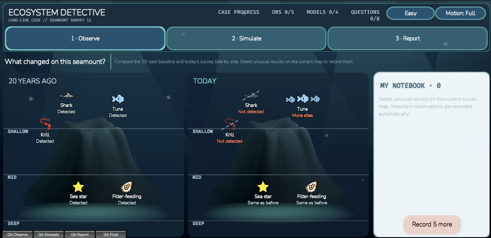
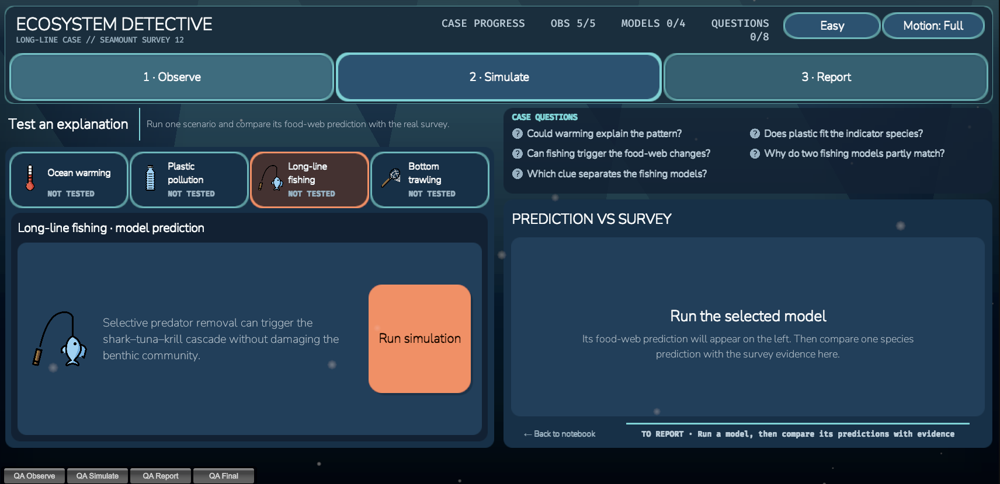
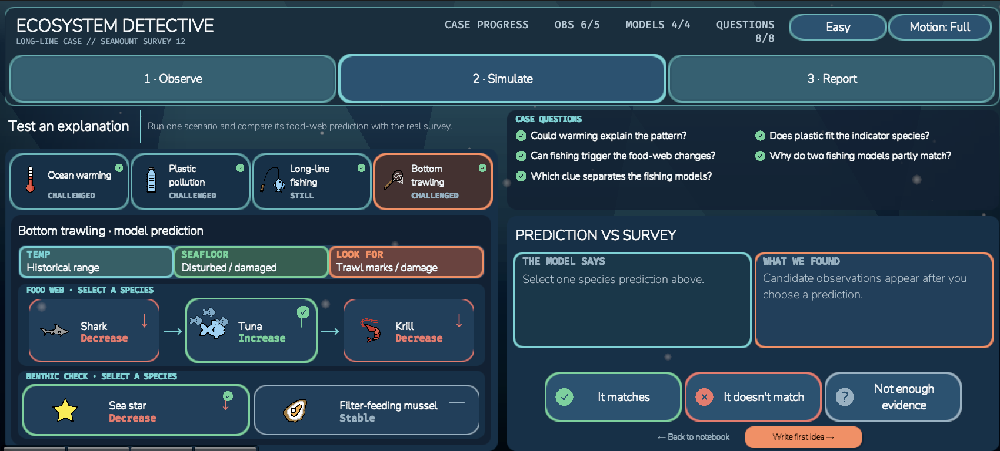

# Ecosystem Detective — Detective Game Part

Documentation for the Ecosystem Detective part of the OceanX eDNA Detectives Unity project. This three-stage investigation asks players to compare survey results, test competing causes, and build an evidence-based report.

Edna introduces the investigation and keeps the current action visible. Observe and Simulate offer a collapsible task prompt; Report becomes a four-question conversation with Edna. Easy mode offers two increasingly specific `More help` levels; Hard keeps the same questions and scientific rules with less guidance. A new task or report question resets the help level.

`More help`, `Minimise`, and `Show task` use filled, outlined buttons with bold labels and clear help or expand/collapse icons.

## Quick start

1. Open the `game` folder in Unity `6000.4.6f1`.
2. Open `Assets/Scenes/InvestigationScene.unity`.
3. Press Play.

## Current gameplay flow

### 1 · Observe

Players compare the same seamount **20 years ago** and **today**, divided into shallow, mid, and deep depth bands.

Before the first recorded finding, the Notebook area shows a short **Select a
species on TODAY** prompt. Recording that first finding reveals the paper
Notebook in the same space. Historical facts do not create a finding; imported
findings show the Notebook immediately.

In Easy mode, every unrecorded case species on TODAY has a synchronised pulsing
frame. Players may start with any of them. Recording a finding removes that
species' cue while the remaining unrecorded species keep their cues. Historical
species and recorded-finding checks do not pulse.

Both maps share a synchronised 20-second background cycle: natural rock (A) →
brighter illustration (B) → bathymetric colours (C) → B → A. The mountain and
camera stay fixed, so the appearance cycle does not imply an ecological change.
Recording findings and refreshing the UI do not restart it. Reduced Motion
holds the natural view.

- Five case-critical organisms always appear, and up to two additional species can be selected from the shared 20-species catalog when upstream survey results are supplied.
- Visible organisms use depth-aware scattering rather than fixed slots, so larger survey rosters can fill each depth band without leaving authored gaps. Each new case or Restart gets a fresh arrangement, while positions remain stable throughout that run.
- Detected and confidently not-detected species from an upstream eDNA result can join the survey roster automatically. The deterministic roster ranks food-web relevance, unusual results, confidence and sample quality, caps the screen at seven species, and falls back to the five authored case organisms when no input is supplied.
- Detailed handoff records carry species ID, detection state, survey era, depth, confidence, sample quality, site, sample and source. Legacy `detectedSpeciesIds` inputs remain supported.
- Imported catalog species appear only in the survey era supplied by the input. Their depth controls map placement, and an imported non-detection uses the same ghosted artwork and dashed removal mark as authored evidence.
- The seamount maps show organism artwork only; names, survey status and species facts appear on hover, keyboard focus or tap and are recorded in the Notebook.
- Easy mode marks one initial organism on **TODAY** with a temporary focus frame so the first interaction is discoverable; the frame disappears after the first finding.
- Edna opens with the purpose of the investigation and one first action. After a finding is selected, her response names it and distinguishes stable results from non-detection, then gives the remaining Observe count.
- A current non-detection uses ghosted artwork and a dashed removal mark instead of an empty space.
- Wider detection appears as a small group.
- Hovering, keyboard-focusing, or tapping a marker opens its species facts.
- Tapping a current marker records the observation; historical markers are read-only.
- Recorded case findings show a check on their current marker. Viewing a species highlights its corresponding markers on both maps. Details identify the survey era, source and whether a finding has been recorded.
- Clicked species details and their paired-map highlight disappear after 1.5 seconds; another tap restarts that interval. The recorded-finding check remains visible. Hover and keyboard focus retain their transient behavior, and Close can dismiss details sooner. Compact Notebook entries use the case's short gameplay names; species details retain the full name.
- Stable species are explicitly part of the Observe task. Supplementary imported species are labelled as background survey records and do not count towards the required findings.
- Authored case findings remain the source of truth for the five core species. Incompatible upstream detection patterns are rejected before any input is applied; players may explicitly choose **Start standalone case** to use the authored survey instead. Additional species use the same resolved result in map styling and tooltips, including historical non-detections.
- Before the findings are complete, the Notebook shows neutral `Findings 0 / 5` progress instead of a disabled primary button. The `Test possible causes` action appears only after all five initial findings are recorded.
- Selecting a historical organism opens its facts and explains that the 20-year survey is a read-only reference.
- All five initial findings must be recorded before Simulate unlocks.
- The domain and UI share the same required-finding calculation; method notes and repeated discoveries cannot substitute for a missing case finding.
- The field notebook records each finding in plain language with its evidence source and confidence, grouped into **Food-web pattern** and **Stable controls**.

The same Notebook remains available in Simulate and Report as a non-destructive side drawer in landscape and a bottom sheet in portrait. Opening it does not change phase or clear the current selection, and its reading position is preserved when it is closed and reopened. Each entry shows whether it is `NEW`, `USED` in a committed comparison, still an `OPEN` question, or selected for the final `REPORT`; evidence related to the currently selected prediction is highlighted without being auto-selected.

The Notebook's **Compare causes** section shows three compact cards with Support, Challenge and Open counts. Only the selected cause expands its short comparison links. These counts come from the player's checks, not probabilities or a ranking of the correct answer. Unreviewed ROV clues and locked follow-up comparisons remain hidden. Keyboard focus scrolls the controls into view.

In Simulate and Report, the collapsed Notebook is a small illustrated book with a teal spine, bookmark and finding-count badge. It has no persistent text caption. Hover or keyboard focus identifies its open/close action; activating it opens the existing drawer with a brief transition (instant in reduced-motion mode). Closing the drawer returns focus to the book and preserves the reading position.

The expanded Notebook uses a punched paper margin and six shaded binding rings along its left edge. The same binding appears on the Observe notebook. Text and scrolling content are inset beyond the binding, and the rings remain fixed while the entries scroll; all binding artwork is non-interactive.

### 2 · Simulate

Players test three competing explanations:

- Plastic pollution
- Long-line fishing
- Bottom trawling

The temperature/warming scenario has been removed from this prototype. Five comparisons lead to the first idea, followed by two benthic comparisons after the ROV reveal. Observe still requires all five core findings.

Running a model reveals its seafloor prediction, physical signs to look for, Shark → Tuna → Krill food-web response, and a separate benthic check for Sea star and Filter-feeding mussel.

Model cards separate check progress (**NOT RUN**, **TO CHECK**, **ROV NEXT**,
**CHECKED**, with completed/required counts) from the recorded evidence's
relationship (**SUPPORTS**, **CHALLENGES**, **MIXED EVIDENCE**, or **UNRESOLVED**).
A green check appears only when all required comparisons for that model are
complete. These labels use recorded comparisons rather than the authored answer.

During cause selection, Easy mode gives all available unfinished models equal
pulsing arrows. Choosing a model switches to the **Run simulation** arrow.
Selecting a prediction adds a short **SELECT ONE FINDING** instruction, a down
arrow and a pulsing border to **WHAT WE FOUND**. The evidence cue remains after
an inconclusive selection and disappears when the comparison is settled. All
cues share a stronger, slow pulse; collapsing Edna hides them and Reduced Motion
keeps them still and fully visible.

Food-web relationships are stored as explicit predator → prey edges grouped into named networks. The current mystery uses a deliberately simplified `case_simplified` network so its existing evidence and comparison rules remain valid. A separate five-node `reference_main` network and the storyboard's manta, deep-water and benthic branches are also authored. Missing model predictions can be propagated through the selected network, while explicit threat predictions always take precedence.

The comparison workspace uses progressive disclosure: players choose a cause, run it, select a prediction, and choose a recorded observation directly under **WHAT WE FOUND**. Selecting the observation immediately checks and records its relationship to the prediction.

The result explains whether the selected finding:

- **Supports the model**
- **Challenges the model**
- **Cannot settle the prediction**

A relevant supporting or challenging finding is saved and locked. Inconclusive or unrelated evidence stays open for another selection and does not advance an objective. The check uses the authored scientific rules and preserves their caveats. Keyboard and pointer selection share this same action; keyboard focus returns to the prediction controls after a comparison is saved.

Feedback remains beside the selected prediction and observation after selection. The comparison workspace grows to fit the explanation.

Simulate places Edna's controls on the heading row and its message underneath, giving the current task room to wrap independently of the model controls.

The case contains seven required investigation objectives grouped into four Case Questions. The first five screen plastic, establish the Shark → Tuna → Krill cascade, and show why the two fishing models partly overlap. The Sea star discriminator remains hidden until after the provisional explanation and ROV follow-up. Easy mode shows only the current Case Question, follows the selected cause, prioritises the directly related `GUIDE` clue, and names the next action. Hard mode keeps the same evidence and scientific feedback, removes guided targets, and shows the full question and candidate sets.

### 3 · Report

Players first submit a provisional explanation. Only then does the fixed ROV follow-up unlock:

- Fishing line recorded near shark habitat
- Seafloor remains intact

**Write first idea** opens a review panel showing the proposed cause and its recorded checks. Players can change the cause, cancel, or explicitly save the idea. The review scrolls in short viewports, and keyboard-focused actions remain visible.

The same follow-up appears regardless of the provisional choice, so the game never changes its evidence to match the player's answer. The intact-seafloor clue then sends the player back to Simulate for a focused Sea star comparison under Long-line fishing and Bottom trawling. Completing those final two objectives unlocks the final report.

When the ROV follow-up opens, the fishing-line and intact-seafloor cards reveal in sequence and are explicitly marked as added to the Notebook. Reduced-motion mode shows both immediately. Keyboard focus then moves to the single `Compare fishing models` action.

The ROV step displays two sealed finding cards before review, then larger evidence cards containing the authored field-note details. Its Open/Compare action sits inside the evidence panel so the next step is visible next to the findings.

After the ROV findings have been checked against both fishing models, the report presents one question at a time:

- Which cause best explains your findings?
- How did that cause the food-web changes?
- Which findings support your explanation?
- What can your evidence still not tell us?

A valid report requires all seven comparison objectives plus four unique findings, including at least two food-web observations, one benthic observation, and one ROV confirmation observation. It also requires the food-web mechanism and one scientific limitation. Incorrect submissions are recorded as revisions and explain which part of the pattern remains unsupported.

Single-choice answers advance to the next question when valid. Evidence is a multi-selection question with a Continue action. Edna acknowledges the previous answer, and a question counter shows progress. The ROV task appears before the conversation; the full report form is not exposed prematurely.

An incomplete answer receives feedback beside that question without counting as a submission. The feedback is available in both difficulties and survives a difficulty change. Previous answers remain in the current session when navigating back, opening the Notebook, or changing stages. Moving to another question resets reading position and moves keyboard focus to its answers.

After the fourth answer, a read-only review shows the complete draft with an Edit action for each part. Editing returns to the review while retaining the other answers. Only Send report submits the final judgement. A rejected report opens the part that needs revision.

A correct report replaces the editable form with a **Case Closed** debrief covering the best-supported cause, food-web mechanism, benthic discriminator, ROV follow-up, and remaining uncertainty.

Edna supplies the next action, comparison feedback explains the selected result, and the Notebook keeps the recorded findings and comparison history. Report diagnostics appear locally rather than being repeated in a toast. The header labels completed comparisons as **CHECKS**, keeping them distinct from grouped Case Questions and the four report questions.

## The Missing Predator case

The current vertical slice investigates a repeated shark non-detection, tuna detected at more sites, repeated krill non-detection, and stable benthic indicators.

Long-line fishing and bottom trawling deliberately share the same Shark ↓ / Tuna ↑ / Krill ↓ prediction. Players must use the stable Sea star evidence and intact seafloor to distinguish them. Fishing line near historical shark habitat then strengthens the best-supported Long-line explanation without treating eDNA non-detection as proof of complete absence.

The case currently includes:

- five case-critical species plus a seven-species runtime roster cap;
- a 20-species shared catalog with canonical IDs, scientific names, aliases, trophic roles, depths and habitat tags;
- twelve explicit food-web edges across the current simplified network, the five-node reference chain and three alternative branches;
- three threat models;
- a complete 15-cell Threat × Species prediction matrix;
- seven required comparison objectives;
- two post-provisional ROV observations; and
- an evidence-category-gated final report.

## Difficulty, input, and accessibility

- Easy and Hard change guidance, not the scientific rules or correct answer.
- Edna guides every stage. Observe and Simulate task hints can be collapsed; Report presents one question at a time, with optional extra help in Easy mode.
- Help and collapse controls use filled backgrounds, visible outlines, icons and bold labels.
- Restarting a case preserves the selected difficulty; a new scene session starts at Easy.
- Full and reduced-motion modes are available from every stage.
- Motion is disabled or simplified when reduced motion is active.
- Pointer, keyboard, and touch interactions share the same gameplay path.
- Species markers use generous hit targets and visible keyboard focus rings.
- Selected, suggested, correct, incorrect, and uncertain states use shape or text in addition to colour.
- The canvas supports adaptive landscape and portrait reference resolutions, Safe Area fitting, pixel-perfect rendering, responsive grids, and preserved scroll/focus state.
- Invalid actions use a temporary warning toast. Incomplete-report checks use neutral guidance instead of failure styling.

## Future mini-game integration

The Investigation remains fully playable as a standalone case while exposing a small integration boundary through `EDNA.Core`:

- optional survey and site metadata can replace the authored labels;
- structured eDNA species observations can specify detected/not detected, depth, historical/current era, confidence, sample quality, source, sample and site;
- canonical species IDs and aliases are normalised to the case's stable internal IDs;
- a deterministic roster selects no more than seven organisms while preserving all case-critical species;
- mapped environmental and physical observation IDs are imported only when their authored unlock stage permits it;
- an input for the wrong case stops with a visible configuration error;
- successful results return the case, survey, site, selected hypothesis, evidence IDs, selected survey-species roster, revisions, and completion status; and
- the legacy flat detected-species list remains accepted while the other mini-games migrate to the richer handoff record.

Detailed current records take precedence over legacy detections for the same species within a result. Imports reject invalid eras/enums, records outside an explicitly supplied site, and conflicting detections for the same named sample; distinct samples may carry different results. These checks run before survey metadata, findings or the roster are applied. Core case presentation continues to identify its authored survey rather than treating one imported sample as the full case evidence.

## Screenshots

### Observe — compare the baseline and current survey

### Simulate — choose and run a cause

### Simulate — compare model predictions with survey evidence

### Report — assemble the final evidence-based explanation

## Development and validation

Development builds and the Unity Editor expose an expandable **QA tools** menu
at the bottom-left, with one fully filled checkpoint per stage. Selecting a
checkpoint closes it and restores gameplay input.
It preserves the selected difficulty and uses the real domain API to construct
valid data. Non-development players do not include these controls.

| Checkpoint | State | Ctrl+Shift key |
| --- | --- | --- |
| Observe | All five findings recorded; ready to continue | 1 |
| Simulate | All initial comparisons done; ready to choose a provisional explanation | 2 |
| Report | ROV reviewed, all seven checks done, valid final draft ready to send | 3 |

The case authoring commands generate the three-cause configuration. `eDNA Detectives > Remove Warming Scenario` upgrades older four-cause case assets to this configuration.

Validation commands are available from the Unity menu:

- `eDNA Detectives > Validation > Run EditMode Tests`
- `eDNA Detectives > Validation > Run PlayMode Tests`

The test assemblies are:

- `EDNA.Investigation.EditModeTests`
- `EDNA.Investigation.PlayModeTests`

The project also includes command-line development build validation for the standalone Investigation scene.

## Project structure

- `game/Assets/Scripts/Core` — shared mini-game contracts and enums
- `game/Assets/Scripts/Investigation/Domain` — deterministic case rules and evaluation
- `game/Assets/Scripts/Investigation/Integration` — controller, session bridge, and QA state factory
- `game/Assets/Scripts/Investigation/Presentation` — runtime uGUI, responsive layouts, icons, and animation
- `game/Assets/Data/Investigation/LongLineCase` — species, threats, evidence, objectives, and report configuration
- `game/Assets/Tests/EditMode/Investigation` — domain and authoring validation
- `game/Assets/Tests/PlayMode/Investigation` — scene, UI, accessibility, and full-flow regression tests

## Artwork and licences

The five core organisms use a coordinated set of transparent field-guide illustrations generated for this project. Source files, import settings and the prompt record are documented in [FieldGuide/README.md](game/Assets/Art/Investigation/FieldGuide/README.md).

Threat and scenario artwork continues to use [OpenMoji](https://openmoji.org/), licensed under [CC BY-SA 4.0](game/Assets/Art/Investigation/OpenMoji/LICENSE.txt). The original organism icons are retained in the same folder. Per-file source codes and attribution are recorded in [ATTRIBUTION.md](game/Assets/Art/Investigation/OpenMoji/ATTRIBUTION.md).

Check, cross, question, lock, and Report evidence marks use transparent Heroicons assets under the included MIT licence.

The Observe seamount uses three in-house Blender renders blended in Unity. Its
source and playback settings are recorded in [GENERATION.md](game/Assets/Resources/Investigation/Seamount/GENERATION.md).
The original static fallback retains its [generation record](game/Assets/Art/Investigation/Seamount/GENERATION.md).

The interface uses a compact phase navigation with completion checks, restrained blue surfaces, teal selections, coral primary actions and warm paper for investigation records. Prediction direction is carried by labels and arrows; red and green remain available for comparison feedback. Keyboard focus uses a thin hollow stroke. Water particles remain behind the interface, historical specimens are subdued, and both maps use aligned depth guides. Case Closed adds a brief review-stamp animation that is skipped in reduced-motion mode.
