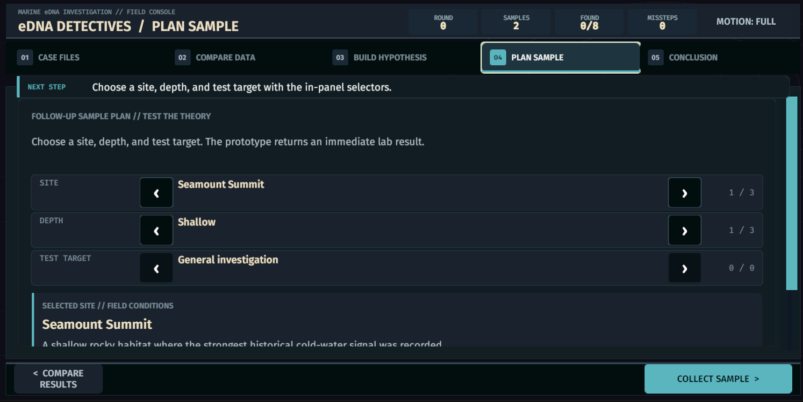
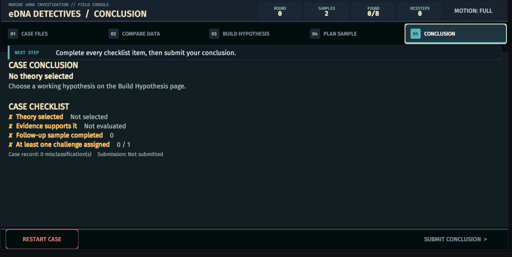
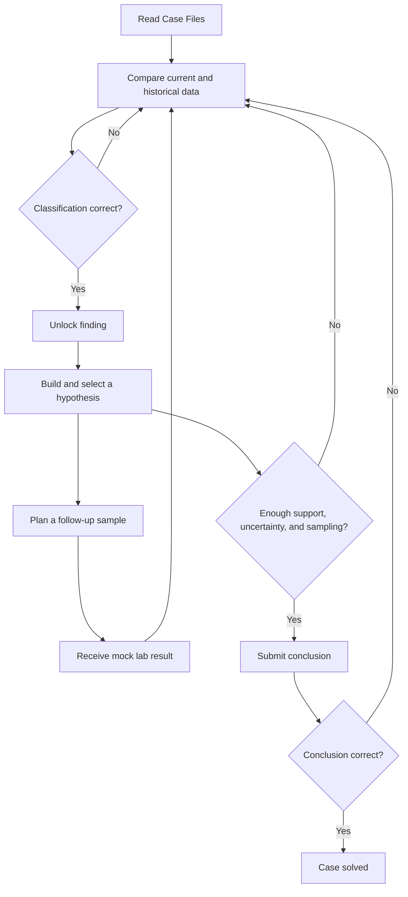

# eDNA Detectives

A Unity web-game prototype for the OceanX eDNA Detectives project.

## Run Ecosystem Detective V2

1. Open the `game` folder in Unity `6000.4.6f1`.
2. Open `Assets/Scenes/InvestigationSceneV2.unity`.
3. Press Play.

V2 is isolated from the original prototype and implements the redesigned three-stage investigation:

1. **Observe** — compare the 20-year baseline seamount and today's seamount side by side, then hover, keyboard-focus, or tap a species for facts. Tapping a current marker also records its observation; tapping a historical marker only opens the facts. Notebook observations scroll inside their own reserved region while the compact stage CTA remains fixed and centered at the bottom.
2. **Simulate** — use a 50/50 desktop workspace: the four causes and staged food-web animation remain together on the left, while Prediction vs survey, candidate evidence, and judgement controls remain together on the right. Increase nodes grow and multiply, decrease nodes shrink and fade. Long-line fishing and Bottom trawling still require the sea-star comparison that separates their otherwise shared cascade, without requiring whole-page scrolling at the landscape reference size.
3. **Report** — submit a provisional cause, review the fixed ROV follow-up, then complete a responsive two-column survey paper: cause and reasoning on the left, evidence and scientific limitation on the right. Incorrect final submissions are recorded as revisions.

The V2 vertical slice uses a complete Long-line Fishing case with five species, four overlapping threats, a 20-cell prediction matrix, Easy/Hard guidance, reduced motion, confirmation evidence, and a final evidence-gated report.

Observe, Simulate, and Report use a compact shared page heading: each stage title and its explanatory sentence sit on the same horizontal row.

Simulate uses an extra-compact variant of that heading and a half-height navigation footer, while Report retains the larger final-submission footer.

Comparison feedback in Simulate no longer reserves a persistent row below the judgement buttons. Incorrect attempts use the existing three-second floating warning toast instead.

The V2 canvas uses adaptive 1280×720 landscape and 720×1280 portrait reference resolutions, width-matched scaling, pixel-perfect rendering, Safe Area fitting, and an 8px shell margin. Observe also adapts the seamount height on unusually short landscape viewports so its primary comparison remains on one screen. Guidance is normally hidden; invalid actions show a temporary three-second warning toast instead of reserving a permanent status row.

The visual system follows a biomimetic field-console direction: reduced corner radii, semantic low-contrast borders, cyan/coral panel accents, frameless species artwork, a pale field-notebook paper surface, concise model-indicator chips, local check/lock feedback, and a distinct yellow keyboard/controller focus ring. Whole-page entrance motion runs only when changing investigation stages; ordinary selections update in place.

Controls follow a hierarchy-specific treatment. Every coral Primary CTA uses the same solid fill, 17px label, and one low-cost shadow across Observe, Simulate, and Report. Dark secondary/stage controls use solid fills and at most one crisp 2px outline. Report paper choices use one shadow plus a real 2px blue-grey structural edge and inset paper face; they do not stack `Outline` and `Shadow` effects or use an imperceptible white bevel. Press scaling and decorative highlight strips remain disabled.

Observe keeps only the `20 YEARS AGO` and `TODAY` map headings. Species appear directly on the seamount: wider detection uses a small icon group, while non-detection uses ghosted artwork with a dashed removal mark. Each frameless marker now places its 13px name and 12px state on a compact semi-transparent deep-ocean plate, keeping normal-text contrast above 4.5:1 even over the brightest seamount layer. My Notebook uses pale cyan-white paper, blue-grey edging and shadow, coral bullets, ruled lines, and bold semantically colored status phrases instead of nested cards. The food-web cascade plays once at half speed; decrease predictions animate from a group to one organism, while increase predictions animate from one organism to a group. Check, cross, and question status marks use transparent Heroicons PNG assets rather than runtime-drawn glyphs; their MIT license and attribution are included with the assets.

## Run Investigation V1 (legacy)

1. Open the `game` folder in Unity `6000.4.6f1`.
2. Open `Assets/Scenes/InvestigationScene.unity`.
3. Press Play.

The original five-stage Investigation prototype is preserved as V1. A shared main menu and transitions between the three mini-games have not been integrated yet.

## How to play V1

1. **Case Files** — read the briefing and review each species profile.
2. **Compare Data** — compare present-day eDNA samples with records from 20 years ago. Select a card and classify the change.
3. **Build Hypothesis** — choose a theory, then assign identified findings as supporting or challenging evidence.
4. **Plan Sample** — choose a site and depth for a follow-up sample. The prototype returns an immediate mock laboratory result.
5. **Conclusion** — select the best-supported theory and submit it.

Incorrect classifications are recorded as missteps and that option is ruled out for the selected card. They do not end the game.

A successful conclusion needs:

- a supported hypothesis;
- at least one completed follow-up sample; and
- at least one challenging or uncertain finding.

## Screenshots

### Case Files

### Compare Data

### Build Hypothesis

### Plan Sample

### Conclusion

## Gameplay flow

## Validation

From the Unity menu:

- `eDNA Detectives > Validation > Run EditMode Tests`
- `eDNA Detectives > Validation > Run PlayMode Tests`

V2 also includes dedicated `EDNA.Investigation.V2.EditModeTests` and `EDNA.Investigation.V2.PlayModeTests` assemblies.

## Artwork credits

Investigation V2 uses transparent PNG artwork from [OpenMoji](https://openmoji.org/). All emojis are designed by OpenMoji, the open-source emoji and icon project, and are licensed under [CC BY-SA 4.0](game/Assets/Art/InvestigationV2/OpenMoji/LICENSE.txt). The per-file source codes are recorded in [ATTRIBUTION.md](game/Assets/Art/InvestigationV2/OpenMoji/ATTRIBUTION.md).
