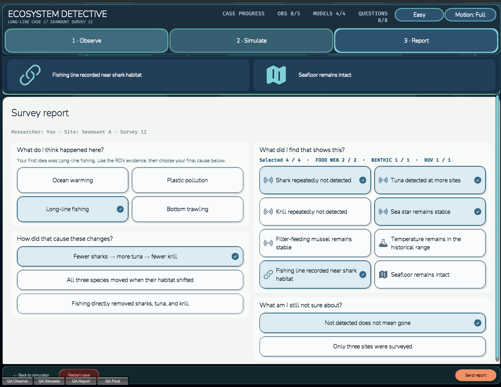

# eDNA Detectives — Ecosystem Detective V2

A Unity web-game vertical slice for the OceanX eDNA Detectives project. The current design is a three-stage ecosystem investigation in which players compare survey results, test competing causes, and build an evidence-based report.

> V2 is the current implementation. The original five-stage V1 prototype remains in the repository as legacy reference only.

## Quick start

1. Open the `game` folder in Unity `6000.4.6f1`.
2. Open `Assets/Scenes/InvestigationSceneV2.unity`.
3. Press Play.

## Current gameplay flow

### 1 · Observe

Players compare the same seamount **20 years ago** and **today**, divided into shallow, mid, and deep depth bands.

- Five case-relevant organisms appear at their habitat depths.
- A current non-detection uses ghosted artwork and a dashed removal mark instead of an empty space.
- Wider detection appears as a small group.
- Hovering, keyboard-focusing, or tapping a marker opens its species facts.
- Tapping a current marker records the observation; historical markers are read-only.
- All five initial findings must be recorded before Simulate unlocks.
- The field notebook records each finding in plain language with its evidence source and confidence, grouped into **Food-web pattern** and **Stable controls**.

### 2 · Simulate

Players test four competing explanations:

- Ocean warming
- Plastic pollution
- Long-line fishing
- Bottom trawling

Running a model reveals its temperature prediction, seafloor prediction, physical signs to look for, Shark → Tuna → Krill food-web response, and a separate benthic check for Sea star and Filter-feeding mussel.

Players select one prediction, pair it with a recorded observation, and judge the relationship as:

- **It matches**
- **It doesn't match**
- **Not enough evidence**

A supported Match or Mismatch is committed and locked. A scientifically reasonable Not enough evidence judgement remains revisable and does not advance an objective by itself.

The case contains eight required investigation objectives grouped into five Case Questions. The first six screen warming and plastic, establish the Shark → Tuna → Krill cascade, and show why the two fishing models partly overlap. The Sea star discriminator remains hidden until after the provisional explanation and ROV follow-up. Easy mode follows the currently selected cause, prioritises the directly related `GUIDE` clue, and names the next action. Hard mode keeps the same evidence and scientific feedback but removes guided targets and shows the full candidate set.

### 3 · Report

Players first submit a provisional explanation. Only then does the fixed ROV follow-up unlock:

- Fishing line recorded near shark habitat
- Seafloor remains intact

The same follow-up appears regardless of the provisional choice, so the game never changes its evidence to match the player's answer. The intact-seafloor clue then sends the player back to Simulate for a focused Sea star comparison under Long-line fishing and Bottom trawling. Completing those final two objectives unlocks the final report.

The final survey report asks four plain-language questions:

- What do I think happened here?
- How did that cause these changes?
- What did I find that shows this?
- What am I still not sure about?

A valid report requires all eight comparison objectives plus four unique findings, including at least two food-web observations, one benthic observation, and one ROV confirmation observation. It also requires the food-web mechanism and one scientific limitation. Incorrect submissions are recorded as revisions and explain which part of the pattern remains unsupported.

A correct report replaces the editable form with a **Case Closed** debrief covering the best-supported cause, food-web mechanism, benthic discriminator, ROV follow-up, and remaining uncertainty.

## The Missing Predator case

The current vertical slice investigates a repeated shark non-detection, tuna detected at more sites, repeated krill non-detection, and stable benthic indicators.

Long-line fishing and bottom trawling deliberately share the same Shark ↓ / Tuna ↑ / Krill ↓ prediction. Players must use the stable Sea star evidence and intact seafloor to distinguish them. Fishing line near historical shark habitat then strengthens the best-supported Long-line explanation without treating eDNA non-detection as proof of complete absence.

The case currently includes:

- five species;
- four threat models;
- a complete 20-cell Threat × Species prediction matrix;
- one additional temperature prediction target;
- eight required comparison objectives;
- two post-provisional ROV observations; and
- an evidence-category-gated final report.

## Difficulty, input, and accessibility

- Easy and Hard change guidance, not the scientific rules or correct answer.
- Restarting a case preserves the selected difficulty; a new scene session starts at Easy.
- Full and reduced-motion modes are available from every stage.
- Motion is disabled or simplified when reduced motion is active.
- Pointer, keyboard, and touch interactions share the same gameplay path.
- Species markers use generous hit targets and visible keyboard focus rings.
- Selected, suggested, correct, incorrect, and uncertain states use shape or text in addition to colour.
- The canvas supports adaptive landscape and portrait reference resolutions, Safe Area fitting, pixel-perfect rendering, responsive grids, and preserved scroll/focus state.
- Invalid actions use a temporary warning toast. Incomplete-report checks use neutral guidance instead of failure styling.

## Future mini-game integration

V2 remains fully playable as a standalone case while exposing a small integration boundary through `EDNA.Core`:

- optional survey and site metadata can replace the authored labels;
- mapped environmental and physical observation IDs are imported only when their authored unlock stage permits it;
- an input for the wrong case stops with a visible configuration error;
- successful results return the case, survey, site, selected hypothesis, evidence IDs, revisions, and completion status; and
- raw CTD/eDNA outputs remain outside the Detective domain until a dedicated adapter is agreed with the other mini-games.

## Screenshots

### Observe — compare the baseline and current survey

### Simulate — choose and run a cause

### Simulate — compare model predictions with survey evidence

### Report — assemble the final evidence-based explanation

## Development and validation

Development builds and the Unity Editor expose four QA checkpoints along the bottom of the Game view:

- `QA Observe`
- `QA Simulate`
- `QA Report`
- `QA Final`

These checkpoints construct valid states through the real domain API and are excluded from non-development players.

Validation commands are available from the Unity menu:

- `eDNA Detectives > Validation > Run V2 EditMode Tests`
- `eDNA Detectives > Validation > Run V2 PlayMode Tests`

The V2 test assemblies are:

- `EDNA.Investigation.V2.EditModeTests`
- `EDNA.Investigation.V2.PlayModeTests`

The project also includes command-line development build validation for the standalone V2 scene.

## Project structure

- `game/Assets/Scripts/Core` — shared mini-game contracts and enums
- `game/Assets/Scripts/InvestigationV2/Domain` — deterministic case rules and evaluation
- `game/Assets/Scripts/InvestigationV2/Integration` — controller, session bridge, and QA state factory
- `game/Assets/Scripts/InvestigationV2/Presentation` — runtime uGUI, responsive layouts, icons, and animation
- `game/Assets/Data/InvestigationV2/LongLineCase` — species, threats, evidence, objectives, and report configuration
- `game/Assets/Tests/EditMode/InvestigationV2` — domain and authoring validation
- `game/Assets/Tests/PlayMode/InvestigationV2` — scene, UI, accessibility, and full-flow regression tests

## Artwork and licences

Investigation V2 uses transparent artwork from [OpenMoji](https://openmoji.org/), licensed under [CC BY-SA 4.0](game/Assets/Art/InvestigationV2/OpenMoji/LICENSE.txt). Per-file source codes and attribution are recorded in [ATTRIBUTION.md](game/Assets/Art/InvestigationV2/OpenMoji/ATTRIBUTION.md).

Check, cross, question, lock, and Report evidence marks use transparent Heroicons assets under the included MIT licence.

The Observe seamount is an in-house deterministic Blender render. Its source hashes, crop, seed, and downsampling recipe are recorded in [GENERATION.md](game/Assets/Art/InvestigationV2/Seamount/GENERATION.md).
