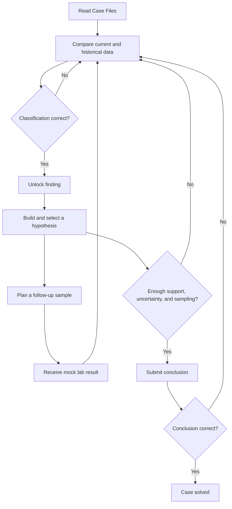

# eDNA Detectives

A Unity web-game prototype for the OceanX eDNA Detectives project.

## Run Ecosystem Detective V2

1. Open the `game` folder in Unity `6000.4.6f1`.
2. Open `Assets/Scenes/InvestigationSceneV2.unity`.
3. Press Play.

V2 is isolated from the original prototype and implements the redesigned three-stage investigation:

1. **Observe** — compare the 20-year baseline seamount and today's seamount side by side, then hover, keyboard-focus, or tap a species for facts. Tapping a current marker also records its observation; tapping a historical marker only opens the facts. Notebook observations scroll inside their own reserved region while the compact stage CTA remains fixed and centered at the bottom.
2. **Simulate** — use a compact 50/50 investigation workspace that fits in one landscape viewport: run all four causes and complete eight authored case objectives rather than filling a generic comparison count. Warming exposes a selectable Temperature prediction, Plastic uses the filter-feeding mussel as its indicator check, Long-line requires the full Shark → Tuna → Krill cascade, and Bottom trawling shares the tuna prediction before the Sea-star evidence separates the fishing models. A two-column, five-question case checklist and threat-status labels show investigative progress without revealing the answer.
3. **Report** — submit a provisional cause, review the fixed ROV follow-up, then complete a responsive two-column survey paper: cause and reasoning on the left, evidence and scientific limitation on the right. The report requires four unique observations including at least two food-web, one benthic, and one ROV-confirmation item. Incorrect final submissions are recorded as revisions, and restarting an unfinished case requires explicit confirmation.

The V2 vertical slice uses a complete Long-line Fishing case with five species, four overlapping threats, a 20-cell species-prediction matrix plus a Temperature target, Easy/Hard guidance, reduced motion, confirmation evidence, and an objective-gated final report. Accepted scientific judgements, locked comparison slots, and objective progress are separate domain concepts: a reasonable `Not enough evidence` answer remains revisable, while a decisive Context-only comparison can lock without advancing the case.

Development builds and the Unity Editor show four small QA checkpoint buttons along the bottom of the Game view (`QA Observe`, `QA Simulate`, `QA Report`, `QA Final`). They build valid states through the real domain API and are excluded from non-development players.

Observe and Report use a compact shared page heading. Simulate uses independent left and right columns: the original 42px explanation heading sits above the model workspace, while the 110px Case Questions panel sits above Prediction vs survey.

Simulate keeps `Back to notebook` plus the report gate in a 28px compact row at the bottom of the right-hand comparison column. It does not reserve a full-width footer, leaving the left column's lower area available for the benthic animation. Report retains the larger final-submission footer.

Comparison feedback in Simulate no longer reserves a persistent row below the judgement buttons. Incorrect attempts use the existing three-second floating warning toast instead.

The V2 canvas uses adaptive 1280×720 landscape and 720×1280 portrait reference resolutions, width-matched scaling, pixel-perfect rendering, Safe Area fitting, and an 8px shell margin. Observe also adapts the seamount height on unusually short landscape viewports so its primary comparison remains on one screen. Guidance is normally hidden; invalid actions show a temporary three-second warning toast, while an incomplete report check uses a neutral in-view diagnostic toast instead of reserving a permanent status row.

The visual system follows a biomimetic field-console direction: reduced corner radii, semantic low-contrast borders, cyan/coral panel accents, frameless species artwork, a pale field-notebook paper surface, concise model-indicator chips, local check/lock feedback, and a distinct yellow keyboard/controller focus ring. Observation status phrases keep the same semantic color language from the Notebook into the Simulate evidence choices, using brighter dark-surface variants for contrast. Whole-page entrance motion runs only when changing investigation stages; ordinary selections update in place.

Controls follow a hierarchy-specific treatment. Every coral Primary CTA uses the same solid fill and 17px label; dark surfaces use the dark `PrimaryShadow`, while the Notebook Primary uses the blue-grey `PaperShadow`. Dark secondary/stage controls use solid fills and a single crisp outline: inactive stages remain 2px, while the active stage uses a complete 3px cyan border instead of a bottom-only accent. Report paper choices use one shadow plus a `#748E9B` structural edge with at least 3:1 contrast against the paper and an inset paper face; they do not stack `Outline` and `Shadow` effects or use an imperceptible white bevel. Press scaling and decorative highlight strips remain disabled.

Observe keeps only the `20 YEARS AGO` and `TODAY` map headings. Both surveys reuse the same deterministic, in-house Blender render of a flat-topped guyot, with code-drawn sediment mist softening the foot of the sprite. The Sprite and fog are isolated inside a `RectMask2D` visual clip, so an extreme aspect ratio cannot push the mountain into the depth-label region; species markers remain outside that mask. Species and the seamount share one plot coordinate system: water-column species sit over transparent water while benthic indicators sit on non-transparent rock. Wider detection uses a small icon group, while non-detection uses ghosted artwork with a dashed removal mark. Each frameless marker places its 13px name and 12px state directly over the scene with a compact deep-water text outline instead of a label plate. My Notebook uses pale cyan-white paper, blue-grey edging and shadow, coral bullets, ruled lines, and bold semantically colored status phrases instead of nested cards. The food-web cascade plays once at half speed; independent benthic predictions follow as a parallel pair using the same group-to-one or one-to-group visual grammar. Check, cross, question, and Report evidence marks use transparent Heroicons PNG assets rather than runtime-drawn glyphs; their MIT license and attribution are included with the assets.

## Run Investigation V1 (legacy)

1. Open the `game` folder in Unity `6000.4.6f1`.
2. Open `Assets/Scenes/InvestigationScene.unity`.
3. Press Play.

The original five-stage Investigation prototype is preserved as V1. A shared main menu and transitions between the three mini-games have not been integrated yet.

## How to play V1

1. **Case Files** — read the briefing and review each species profile.
2. **Compare Data** — compare present-day eDNA samples with records from 20 years ago. Select a card and classify the change.
3. **Build Hypothesis** — choose a theory, then assign identified findings as supporting or challenging evidence.
4. **Plan Sample** — choose a site and depth for a follow-up sample. The prototype returns an immediate mock laboratory result.
5. **Conclusion** — select the best-supported theory and submit it.

Incorrect classifications are recorded as missteps and that option is ruled out for the selected card. They do not end the game.

A successful conclusion needs:

- a supported hypothesis;
- at least one completed follow-up sample; and
- at least one challenging or uncertain finding.

## Screenshots

### Ecosystem Detective V2 — Observe

### Case Files

### Compare Data

### Build Hypothesis

### Plan Sample

### Conclusion

## Gameplay flow

## Validation

From the Unity menu:

- `eDNA Detectives > Validation > Run EditMode Tests`
- `eDNA Detectives > Validation > Run PlayMode Tests`

V2 also includes dedicated `EDNA.Investigation.V2.EditModeTests` and `EDNA.Investigation.V2.PlayModeTests` assemblies.

## Artwork credits

Investigation V2 uses transparent PNG artwork from [OpenMoji](https://openmoji.org/). All emojis are designed by OpenMoji, the open-source emoji and icon project, and are licensed under [CC BY-SA 4.0](game/Assets/Art/InvestigationV2/OpenMoji/LICENSE.txt). The per-file source codes are recorded in [ATTRIBUTION.md](game/Assets/Art/InvestigationV2/OpenMoji/ATTRIBUTION.md).

The Observe seamount is an in-house deterministic Blender render. Its seed, source hashes, crop and downsampling recipe are recorded in [GENERATION.md](game/Assets/Art/InvestigationV2/Seamount/GENERATION.md); only the single approved hero angle is included in the Unity project.
