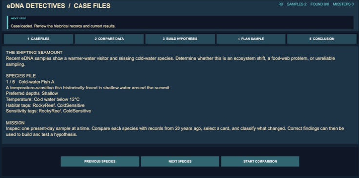
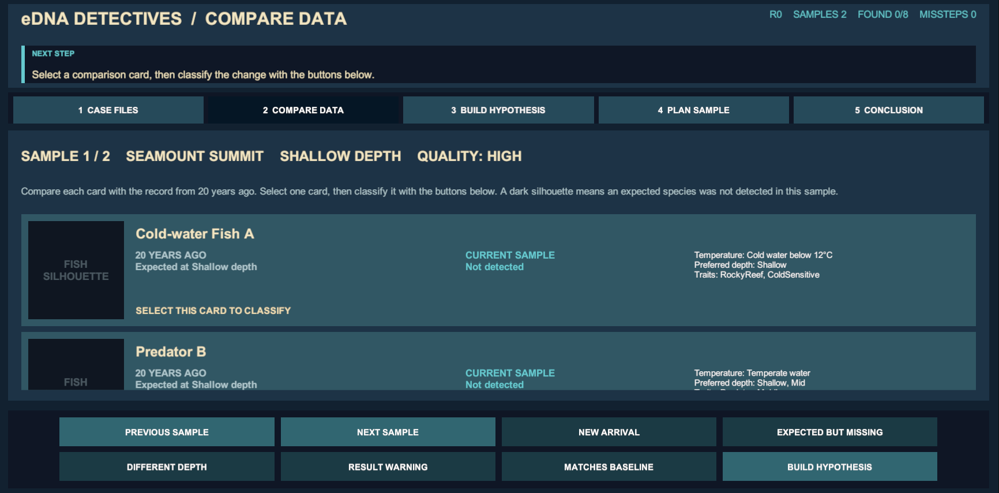
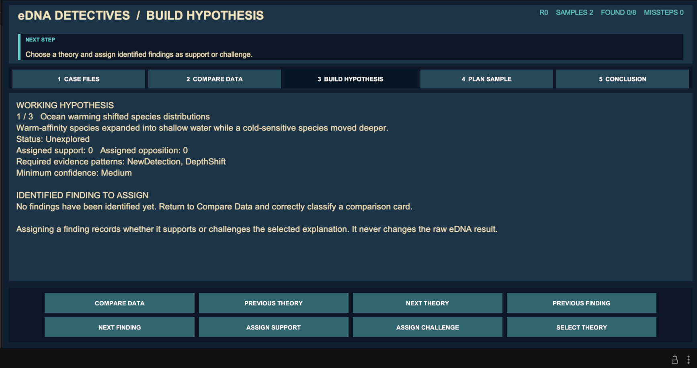
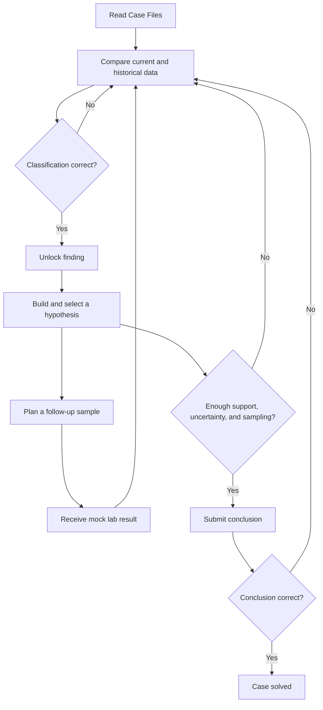

# eDNA Detectives

A Unity web-game prototype for the OceanX eDNA Detectives project.

## Run the Investigation prototype

1. Open the `game` folder in Unity `6000.4.6f1`.
2. Open `Assets/Scenes/InvestigationScene.unity`.
3. Press Play.

The Investigation scene is currently a standalone prototype. A shared main menu and transitions between the three mini-games have not been integrated yet.

## How to play

1. **Case Files** — read the briefing and review each species profile.
2. **Compare Data** — compare present-day eDNA samples with records from 20 years ago. Select a card and classify the change.
3. **Build Hypothesis** — choose a theory, then assign identified findings as supporting or challenging evidence.
4. **Plan Sample** — choose a site and depth for a follow-up sample. The prototype returns an immediate mock laboratory result.
5. **Conclusion** — select the best-supported theory and submit it.

Incorrect classifications are recorded as missteps and that option is ruled out for the selected card. They do not end the game.

A successful conclusion needs:

- a supported hypothesis;
- at least one completed follow-up sample; and
- at least one challenging or uncertain finding.

## Screenshots

### Case Files

### Compare Data

### Build Hypothesis

## Gameplay flow

## Validation

From the Unity menu:

- `eDNA Detectives > Validation > Run EditMode Tests`
- `eDNA Detectives > Validation > Run PlayMode Tests`
